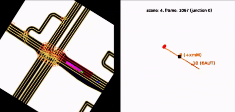

# Modeling traffic lights at an intersection
## Intro
Self-driving vehicles (SDV's) cannot observe states of all traffic lights at an intersection. But traffic lights are important for a good understanding of the overall situation at the intersection.

When observing just a single red traffic light, how well can we guess the current color of all other traffic lights at the intersection?

Other vehicles observed by the SDV suggest statuses of different traffic lights at the intersection.

How would our current best guesses change if in addition to the red traffic light we observe some vehicles at the intersection?

In this pet project, I attempt to estimate the statuses of all traffic lights based on a limited amount of SDV's observations.

## Results overview (TL;DR)
In my experiments, for this particular scene I got the following out-of-sample guesses:
  * After observing a single red light

  * After observing some vehicles in addition to the red traffic light:

  * Later, after observing more vehicles for a longer period of time:
  
  
  
*GIF with the predictions*:

  
## Data
[Lyft level 5 self-driving system Prediction dataset](https://self-driving.lyft.com/level5/data/).

## Approach overview
### Model
I used a bidirectional LSTM model. 

For a better intuitive understanding of the underlying model, let me provide an analogy with NLP applications. 
Each SDV's observation can be viewed as a separate word, and the green light can be viewed as a positive sentiment of a document, while the red light can be viewed as a negative sentiment. The main difference from LSTM-based classifiers in NLP is due to the fact that our observations are not evenly sampled in time, so we also use the time of each event. Also, we have different types of events (traffic light vs. idle vehicles vs. moving vehicles). This information is being leveraged by our model as well.

In addition to guessing the traffic light statuses, I attempted to model Weibull distribution of the time remaining before the next color change. I based the experiments on [this work](http://publications.lib.chalmers.se/records/fulltext/253611/253611.pdf). The initial experiments did not give reasonable results: the mode of the remaining time decreases just slightly before the actual change. Likely, I've caused the issues by a very imbalanced dataset after I clipped the remaining time at 5 seconds, motivated by the fact that the Lyft level 5 challenge required prediction for the next 5 seconds. Sparse and noisy labels might have complicated the distribution modeling as well.

Each traffic light has its own heads in the model. During training we update only heads for which we know the ground truth. During eval, all model heads are being scored.

### Inputs
A sequence of available SDV's observations form an input for the RNN. Each observable traffic light would be one type of an event observed. Another type of an event would be moving vehicle on a particular lane. Finally, idle vehicles on a given lane correspond to another event type.

### Targets
Based on the observations we can heuristically guess some traffic light statuses and use it as labels. 

For the illustration please consider the GIF below. 

In this gif:
   * First, we observe a red traffic light, so we know its status for sure.
   * Next, we observe idle vehicles, so we derive that the traffic light, which controls the corresponding lanes, is likely red.
   * Later, we observe vehicles exiting lanes controlled by the traffic light, therefore we derive that the traffic light has a green color.
   * Etc.

## Reproducibility
All the used packages can be installed via standard package managers. The exact package versions I used can be found in the file *lyft_env.yml*.

After the data are downloaded and stored into *input/scenes*, running the bash script ***run_all.sh*** should prepare the data, train, score the models, and create the visualizations of predictions and inputs. 